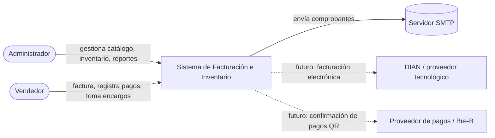
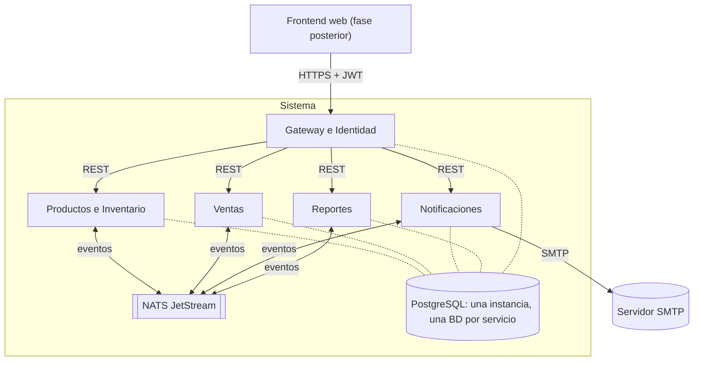
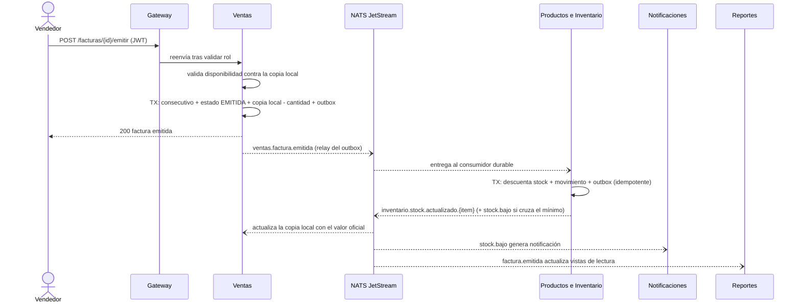
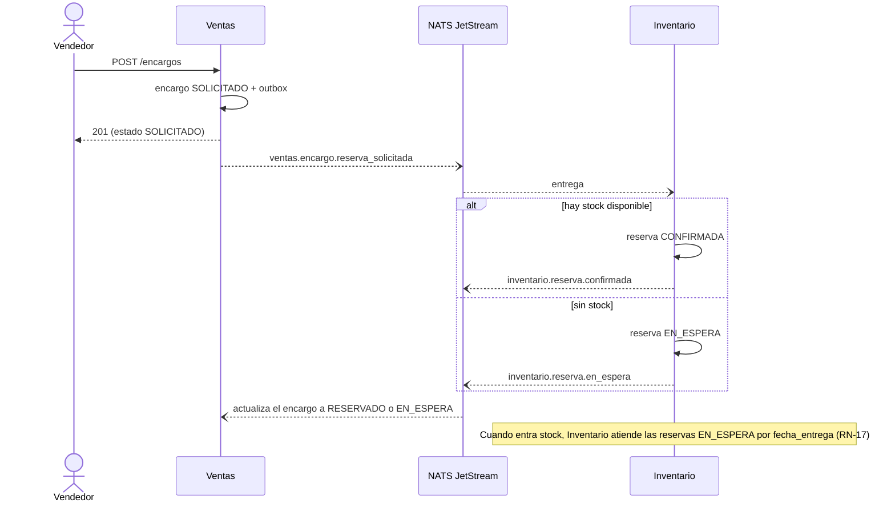

# Arquitectura — Sistema de Facturación e Inventario para Panadería

| | |
|---|---|
| **Versión** | 0.1 (borrador para revisión) |
| **Fecha** | 5 de octubre de 2026 |
| **Base** | Requerimientos v1.0 |
| **Documentos de la Fase 2** | `01-arquitectura.md` (este) · [`02-contratos.md`](../api/02-contratos.md) · [`03-modelo-datos.md`](03-modelo-datos.md) · [ADRs](../adr/README.md) |

Los diagramas están en Mermaid: se ven directamente en GitHub y en la mayoría de editores de Markdown.

---

## 1. Principios de diseño

1. **Límites lógicos primero, servicios después.** Los 8 módulos de los requerimientos se mantienen separados en el código; se agrupan en 5 servicios desplegables donde separarlos no aporta valor (ADR-001).
2. **Hexagonal dentro de cada servicio.** El dominio no conoce HTTP, Postgres ni NATS (ADR-002).
3. **Cada dato tiene un solo dueño.** Nadie lee la base de datos de otro servicio; se habla por API o por eventos.
4. **El flujo crítico es asíncrono y tolerante a fallos.** Facturar no depende de que Inventario esté arriba (RNF-01).
5. **Todo lo que cruza un límite se contrata.** Eventos y APIs tienen esquema versionado (`02-contratos.md`).
6. **Simple por defecto.** Se agrega complejidad (gRPC, Kafka, CQRS completo) solo cuando una decisión documentada la justifique.

---

## 2. Contexto del sistema (C4 nivel 1)



---

## 3. Contenedores (C4 nivel 2)



Todos los servicios están escritos en Go. Solo el Gateway es accesible desde fuera.

---

## 4. Servicios

| Servicio | Módulos internos | Base de datos | Publica | Consume |
|---|---|---|---|---|
| **Gateway e Identidad** | `identidad` (usuarios, login, tokens) · `gateway` (proxy, autorización por rol) | `identidad` | — | — |
| **Productos e Inventario** | `catalogo` · `inventario` | `productos_inventario` | `catalogo.item.actualizado`, `inventario.stock.*`, `inventario.reserva.*` | `ventas.factura.*`, `ventas.nota_credito.emitida`, `ventas.encargo.*` |
| **Ventas** | `clientes` · `facturacion` · `pedidos` | `ventas` | `ventas.factura.*`, `ventas.pago.recibido`, `ventas.nota_credito.emitida`, `ventas.encargo.*` | `catalogo.item.actualizado`, `inventario.stock.actualizado.*`, `inventario.reserva.*` |
| **Notificaciones** | `notificaciones` · `correo` | `notificaciones` | — | `inventario.stock.bajo`, `inventario.stock.negativo`, `ventas.pago.recibido`, `ventas.factura.pagada` |
| **Reportes** | `consultas` · `exportacion` | `reportes` | — | `ventas.factura.*`, `ventas.nota_credito.emitida` |

### Por qué estos cortes

- **Catálogo + Inventario juntos:** ambos giran sobre el mismo concepto (el ítem) y cambian juntos; separarlos solo añadiría un viaje de red por cada consulta de stock.
- **Clientes + Pedidos + Facturación juntos:** el encargo termina en factura, comparten cliente y los anticipos se vuelven pagos de la factura. Quedan como módulos distintos dentro del servicio, con interfaces entre ellos, para poder separarlos más adelante.
- **Se mantienen aparte:** Inventario (consistencia propia y alertas), Notificaciones (consumidor puro, falla sin afectar ventas), Reportes (modelo de lectura reconstruible desde eventos) y Gateway/Identidad (seguridad en un solo punto).

> **Consecuencia importante de la fusión:** como Catálogo e Inventario son un mismo servicio, si cae, Ventas tampoco podría leer precios. Por eso Ventas mantiene una **copia local** de `precio + IVA + disponibilidad` por ítem (ver sección 7), que cubre RNF-01 completo y no solo el stock.

---

## 5. Estructura interna de cada servicio (hexagonal en Go)

```
services/ventas/
├── cmd/ventas/main.go          # composición: crea adaptadores y los conecta a los casos de uso
├── internal/
│   ├── facturacion/            # un módulo (bounded context)
│   │   ├── domain/             # entidades, objetos de valor, reglas. Sin imports de infraestructura
│   │   ├── app/                # casos de uso (EmitirFactura, AnularFactura...) y PUERTOS (interfaces)
│   │   └── adapters/
│   │       ├── http/           # adaptador de entrada: handlers (chi)
│   │       ├── postgres/       # adaptador de salida: repositorios (sqlc + pgx)
│   │       └── nats/           # adaptador de entrada/salida: eventos
│   ├── pedidos/                # misma forma
│   ├── clientes/               # misma forma (más simple)
│   └── platform/               # transversal: config, logging, middleware de auth, outbox, auditoría
├── migrations/
└── api/openapi.yaml
```

**Regla de dependencias:** `adapters → app → domain`. Nunca al revés. Los puertos los define quien los usa (`app`), no quien los implementa.

Ejemplo del patrón, para que veas cómo se ve en Go:

```go
// internal/facturacion/app/puertos.go  — el caso de uso declara lo que necesita
package app

type FacturaRepository interface {
    Guardar(ctx context.Context, f *domain.Factura) error
    BuscarPorID(ctx context.Context, id domain.FacturaID) (*domain.Factura, error)
}

type ProveedorPago interface { // v1.0: implementación manual; v1.1: QR; futuro: proveedor real
    ConfirmarPago(ctx context.Context, p domain.Pago) error
}
```

```go
// internal/facturacion/adapters/postgres/factura_repo.go
// No declara "implements": si tiene los métodos, cumple la interfaz (interfaces implícitas).
type FacturaRepo struct{ db *pgxpool.Pool }

func (r *FacturaRepo) Guardar(ctx context.Context, f *domain.Factura) error { /* ... */ return nil }
func (r *FacturaRepo) BuscarPorID(ctx context.Context, id domain.FacturaID) (*domain.Factura, error) { /* ... */ return nil, nil }
```

**Pragmatismo:** el esquema completo (dominio rico + puertos + adaptadores) se aplica en `facturacion`, `pedidos` e `inventario`, donde hay reglas reales. `catalogo`, `clientes` y `notificaciones` pueden ser más planos (casi CRUD) sin romper la regla de dependencias.

---

## 6. Flujos principales

### 6.1 Emisión de factura (F1)



La respuesta al vendedor se da **antes** de que Inventario procese: eso es lo que permite facturar con Inventario caído.

### 6.2 Encargo con reserva y lista de espera (F3)



**Decisión de diseño:** la lista de espera vive en **Inventario**, no en Pedidos. Quien conoce el stock es quien debe decidir a quién se lo asigna; así se evita una carrera entre dos servicios. Ventas solo refleja el estado. Los requisitos RF-PED-02/03 se cumplen igual.

### 6.3 Anulación (F2), devolución y entrega de encargo

- **Anulación:** Ventas marca la factura `ANULADA` (con motivo y auditoría), publica `ventas.factura.anulada` e Inventario repone el stock.
- **Nota crédito:** publica `ventas.nota_credito.emitida` con una marca por línea (`reingresa_inventario`); Inventario solo repone las que la tienen en `true`.
- **Entrega de un encargo:** Ventas genera la factura con `encargo_id`. Al recibir `ventas.factura.emitida` con `encargo_id`, Inventario **consume la reserva** (reservado y físico bajan a la vez) en lugar de descontar de nuevo.

---

## 7. Consistencia y fiabilidad

| Problema | Solución |
|---|---|
| Guardar en BD y publicar el evento deben ocurrir juntos | **Outbox transaccional:** el evento se inserta en la tabla `outbox` en la misma transacción que el cambio; un proceso (goroutine) lo publica a NATS y lo marca como enviado |
| NATS entrega al menos una vez, puede duplicar | Consumidores **idempotentes:** tabla `eventos_procesados(event_id)` y restricciones únicas en los movimientos (`origen_tipo, origen_id, item_id, tipo`) |
| Publicar dos veces el mismo evento | Cabecera `Nats-Msg-Id = event_id` para deduplicación en el publicador |
| Orden de eventos | Un consumidor secuencial por servicio en v1.0; los eventos de stock llevan `version` y se ignora el que sea más viejo que el aplicado |
| Ventas debe operar con Inventario caído | **Copia local** `item_snapshot` (precio, tarifa IVA, activo, disponible) alimentada por eventos |
| Una Ventas nueva (o reconstruida) necesita el estado actual | Los eventos de stock usan un subject por ítem (`inventario.stock.actualizado.{item_id}`); el consumidor arranca con *deliver last per subject* de JetStream y recibe el último valor de cada ítem |
| Sobreventa en la ventana entre emitir y que Inventario confirme | Ventas descuenta su copia local al emitir; la ventana dura segundos y a ~200 facturas/día el riesgo es mínimo. Si ocurre, el stock puede quedar negativo temporalmente y se alerta al admin (**D-01**, evento `inventario.stock.negativo`) |
| Un servicio consumidor falla | El evento queda en el stream y se reintenta; tras N intentos va a una cola de mensajes muertos (*dead-letter*) para revisión |
| Reintentos del cliente HTTP al emitir o pagar | Cabecera `Idempotency-Key` en los `POST` críticos |

---

## 8. Seguridad

- **Login y tokens:** Identidad emite un JWT de acceso de corta duración (≈15 min) firmado con clave asimétrica y un *refresh token* guardado como hash. Cada servicio **verifica la firma con la clave pública** (endpoint JWKS de Identidad), así que no confía ciegamente en la red interna.
- **Autorización por rol:** el rol viaja como *claim*; el Gateway filtra por ruta y cada servicio vuelve a validar las operaciones sensibles (anular, ajustar inventario).
- **Contraseñas:** hash con argon2id (o bcrypt).
- **Transporte:** HTTPS terminado en un proxy inverso en el despliegue público; red interna aislada en Docker.
- **Secretos:** variables de entorno / Docker secrets; ningún secreto en el repositorio.
- **Datos personales:** el demo público solo usa datos ficticios (RNF-06).
- **Auditoría:** tabla `auditoria` en cada servicio, escrita en la misma transacción que el cambio y sin permisos de `UPDATE`/`DELETE` para el rol de la aplicación (ADR-009).

---

## 9. Despliegue (Docker Compose)

Un solo `docker compose up` levanta: `gateway`, `productos-inventario`, `ventas`, `notificaciones`, `reportes`, `nats`, `postgres` (una instancia con 5 bases y un usuario por servicio), y en desarrollo `mailpit` (SMTP de pruebas). En la Fase 4 se suman Prometheus, Grafana y el colector de OpenTelemetry.

Para el demo público (Fase 5) lo realista es **una sola VM** con este mismo Compose detrás de un proxy inverso con HTTPS.

---

## 10. Estructura del repositorio

```
panaderia-go/
├── services/
│   ├── gateway/
│   ├── productos-inventario/
│   ├── ventas/
│   ├── notificaciones/
│   └── reportes/
├── pkg/                 # solo utilidades sin dominio: logging, config, httpx, natsx, outbox
├── deploy/              # docker-compose.yml, init de Postgres, config de NATS, observabilidad
├── docs/                # requerimientos, arquitectura, adr/, contratos/
├── .github/workflows/   # CI
└── go.work
```

Un `go.mod` por servicio (cada uno compila y se prueba por separado) y `go.work` para trabajar todo junto en local. **Regla:** `pkg/` nunca contiene tipos de dominio; compartir dominio entre servicios es la forma más rápida de volver a un monolito distribuido.

---

## 11. Orden de construcción (impacto en la Fase 3)

| Semana | Entrega |
|---|---|
| 1 | Plantilla de servicio hexagonal + **Catálogo** (el patrón que se replica) |
| 2 | **Inventario**: stock, movimientos, outbox y primeros eventos |
| 3 | **Identidad y Gateway**: login, JWT, proxy y autorización por rol |
| 4-5 | **Ventas**: clientes, facturación, pagos mixtos, copia local, consumo de eventos |
| 6 | **Ventas**: encargos, anticipos y notas crédito · reservas y lista de espera en Inventario |
| 7 | **Notificaciones** y **Reportes** (versión mínima: ventas por periodo + Excel) |

Fase 3 ≈ 6-7 semanas. El total del proyecto sigue en el rango de ~12-13 semanas.
