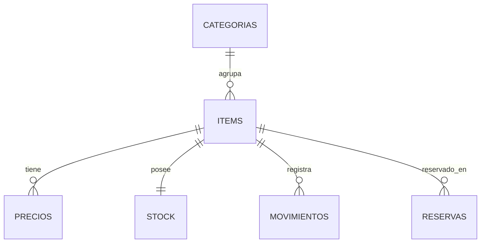
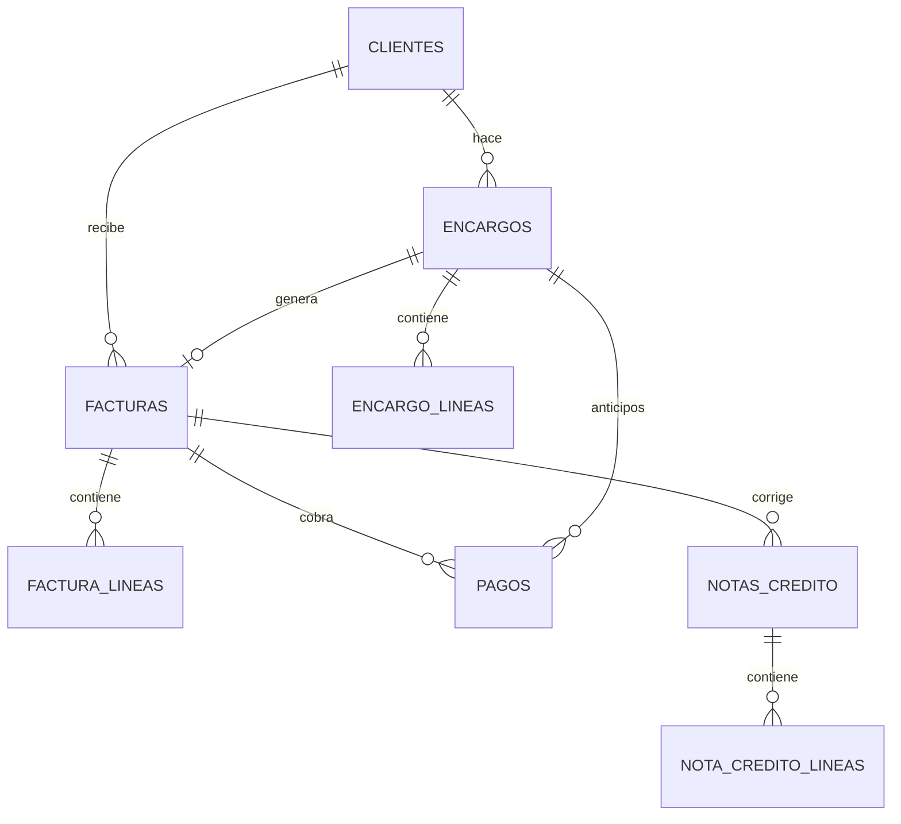

# Modelo de datos por servicio

| | |
|---|---|
| **Versión** | 0.1 (borrador para revisión) |
| **Motor** | PostgreSQL, una instancia con una base de datos y un usuario por servicio (ADR-006) |

Este documento describe el **modelo lógico** (columnas relevantes, claves y restricciones), no el DDL final; el DDL vive en las migraciones de cada servicio.

**Convenciones:** claves primarias `uuid` · dinero en `bigint` centavos (`*_centavos`) · cantidades en `bigint` milésimas (`*_milesimas`) · tarifas en puntos básicos (`*_bp`) · fechas en `timestamptz` (UTC) · nombres de tablas y columnas en español, `snake_case`.

**Tablas transversales** (existen en los 5 servicios salvo que se indique):

| Tabla | Propósito | Columnas clave |
|---|---|---|
| `auditoria` | Registro inmutable de operaciones sensibles (ADR-009) | `id`, `ocurrio_en`, `usuario_id`, `accion`, `entidad`, `entidad_id`, `antes jsonb`, `despues jsonb`, `motivo`, `correlation_id` |
| `outbox` | Eventos pendientes de publicar (no existe en Reportes) | `id` (= `event_id`), `subject`, `payload jsonb`, `creado_en`, `publicado_en null` |
| `eventos_procesados` | Idempotencia de consumidores (no existe en Identidad) | `event_id` PK, `consumidor`, `procesado_en` |

---

## 1. Identidad (`identidad`)

**`usuarios`** — `id` PK · `correo` UNIQUE · `nombre` · `password_hash` · `rol` (`ADMIN`/`VENDEDOR`) · `activo` · `creado_en`

**`refresh_tokens`** — `id` PK · `usuario_id` FK · `token_hash` UNIQUE · `expira_en` · `revocado_en null`

---

## 2. Productos e Inventario (`productos_inventario`)



**`categorias`** — `id` PK · `nombre` UNIQUE

**`items`** — `id` PK · `nombre` · `tipo` (`PRODUCTO_VENDIBLE`/`MATERIA_PRIMA`) · `unidad` · `categoria_id` FK null · `tarifa_iva_bp` · `stock_minimo_milesimas` · `activo` · `version` · `creado_en`

**`precios`** — `id` PK · `item_id` FK · `precio_centavos` (IVA incluido) · `vigente_desde` · `vigente_hasta null` · `creado_por`
- Solo una fila abierta (`vigente_hasta IS NULL`) por ítem: índice único parcial.
- El rango de vigencias de un ítem no se solapa (restricción de exclusión o validación en el dominio).

**`stock`** — `item_id` PK/FK · `fisico_milesimas` · `reservado_milesimas` · `version`
- **Sin** `CHECK (fisico >= 0)`: D-01 permite negativo temporal; se vigila con alerta.
- `disponible = fisico − reservado` (se calcula, no se guarda).

**`movimientos`** (kardex, solo inserción) — `id` PK · `item_id` FK · `tipo` (`ENTRADA_PRODUCCION`, `ENTRADA_COMPRA`, `AJUSTE`, `VENTA`, `ANULACION`, `DEVOLUCION`, `RESERVA`, `LIBERACION`, `CONSUMO_RESERVA`) · `cantidad_milesimas` (con signo) · `origen_tipo` · `origen_id` · `motivo null` · `usuario_id null` · `creado_en`
- `UNIQUE (origen_tipo, origen_id, item_id, tipo)` → un mismo evento no descuenta dos veces.

**`reservas`** — `encargo_id` + `item_id` PK compuesta · `cantidad_milesimas` · `estado` (`CONFIRMADA`/`EN_ESPERA`/`LIBERADA`/`CONSUMIDA`) · `fecha_entrega` · `solicitud_version` · `solicitada_en`
- Índice por `(estado, fecha_entrega)` para atender la lista de espera en orden.

---

## 3. Ventas (`ventas`)



**`clientes`** — `id` PK · `nombre` · `documento_tipo` · `documento` UNIQUE null · `correo null` · `celular null` · `direccion null` · `activo`
- `CHECK (correo IS NOT NULL OR celular IS NOT NULL)` (Q5.1: correo y/o celular).

**`item_snapshot`** (copia local de solo lectura) — `item_id` PK · `nombre` · `tipo` · `unidad` · `precio_centavos` · `tarifa_iva_bp` · `activo` · `disponible_milesimas` · `version_catalogo` · `version_stock` · `actualizado_en`
- Se actualiza solo desde eventos; solo se aplica un evento si su `version` es mayor que la guardada.

**`facturas`** — `id` PK · `prefijo` · `consecutivo null` · `estado` (`BORRADOR`/`EMITIDA`/`PAGADA`/`ANULADA`) · `cliente_id` FK null · `encargo_id` FK null · `descuento_bp` · `total_centavos` · `base_centavos` · `iva_centavos` · `emitida_en null` · `pagada_en null` · `anulada_en null` · `motivo_anulacion null` · `creado_por` · `version`
- `UNIQUE (prefijo, consecutivo)`; el consecutivo es `null` mientras sea borrador.

**`factura_lineas`** — `id` PK · `factura_id` FK · `item_id` · `descripcion` (copia del nombre al vender) · `cantidad_milesimas` · `precio_unitario_centavos` · `tarifa_iva_bp` · `descuento_centavos` · `total_linea_centavos` · `base_centavos` · `iva_centavos`
- Guarda el precio y la tarifa **vigentes al vender**: un cambio de precio posterior no altera facturas pasadas (RN-04).

**`consecutivos`** — `prefijo` PK · `ultimo`
- Se incrementa con bloqueo de fila (`SELECT ... FOR UPDATE`) dentro de la transacción de emisión; si la transacción falla, no se consume número (sin saltos, RN-10).

**`pagos`** — `id` PK · `factura_id` FK null · `encargo_id` FK null · `metodo` (`EFECTIVO`/`NEQUI`/`BANCOLOMBIA`) · `monto_centavos` · `recibido_centavos null` · `cambio_centavos null` · `referencia null` · `estado` (`REGISTRADO`/`ANULADO`/`DEVUELTO`) · `registrado_por` · `creado_en`
- `CHECK (num_nonnulls(factura_id, encargo_id) >= 1)`.
- Un anticipo nace con `encargo_id`; al entregar el encargo se le asigna también `factura_id` (RN-23).
- `recibido_centavos` y `cambio_centavos` solo aplican a efectivo.

**`notas_credito`** — `id` PK · `factura_id` FK · `numero` · `total_centavos` · `motivo` · `creado_por` · `creado_en`
**`nota_credito_lineas`** — `id` PK · `nota_id` FK · `item_id` · `cantidad_milesimas` · `monto_centavos` · `reingresa_inventario` boolean

**`encargos`** — `id` PK · `cliente_id` FK · `estado` (`SOLICITADO`/`RESERVADO`/`EN_ESPERA`/`LISTO`/`ENTREGADO`/`CANCELADO`) · `fecha_entrega` · `notas null` · `factura_id null` · `solicitud_version` · `decision_anticipos null` · `motivo_cancelacion null` · `creado_por` · `version`
**`encargo_lineas`** — `id` PK · `encargo_id` FK · `item_id` · `cantidad_milesimas` · `precio_unitario_centavos` (referencia al pedir; la factura toma el precio vigente al entregar)

**`configuracion`** — `clave` PK · `valor` (p. ej. `descuento_empleado_bp`, `prefijo_factura`)

**`idempotencia`** — `clave` + `ruta` PK · `hash_solicitud` · `respuesta jsonb` · `codigo_http` · `creada_en` (se purga a las 24 h)

---

## 4. Notificaciones (`notificaciones`)

**`notificaciones`** — `id` PK · `tipo` (`STOCK_BAJO`, `STOCK_NEGATIVO`, `PAGO_RECIBIDO`) · `severidad` · `titulo` · `mensaje` · `payload jsonb` · `roles_destino text[]` · `creada_en`
**`lecturas`** — `notificacion_id` + `usuario_id` PK · `leida_en`
- La notificación es una sola por evento y rol; "leída" se guarda por usuario.

**`envios_correo`** — `id` PK · `event_id` UNIQUE · `destinatario` · `asunto` · `estado` (`PENDIENTE`/`ENVIADO`/`FALLIDO`) · `intentos` · `ultimo_error null` · `enviado_en null`
- `event_id` único evita enviar dos veces el mismo comprobante.

---

## 5. Reportes (`reportes`)

Modelos de lectura alimentados por eventos; **se pueden borrar y reconstruir** repitiendo el stream de `VENTAS`.

**`ventas_diarias`** — `fecha` PK · `facturas_emitidas` · `facturas_anuladas` · `total_centavos` · `iva_centavos` · `notas_credito_centavos`
**`ventas_por_item`** — `fecha` + `item_id` PK · `nombre` · `cantidad_milesimas` · `total_centavos`
**`facturas_pendientes`** — `factura_id` PK · `numero` · `cliente_nombre null` · `total_centavos` · `pagado_centavos` · `saldo_centavos` · `emitida_en`
- Una fila se elimina al llegar `ventas.factura.pagada` o `ventas.factura.anulada`.

**`estado_proyeccion`** — `consumidor` PK · `ultimo_evento_en` (alimenta el campo `actualizado_hasta` de las respuestas)

---

## 6. Reglas de cálculo (referencia para el dominio de Facturación)

Todas con enteros en centavos, **redondeo half-up**, calculadas **por línea** para que base e IVA sean consistentes:

```
total_linea_bruto = round(cantidad × precio_unitario)                       // el precio ya incluye IVA
descuento_linea   = round(total_linea_bruto × descuento_bp / 10 000)
total_linea       = total_linea_bruto − descuento_linea
base_linea        = round(total_linea × 10 000 / (10 000 + tarifa_iva_bp))
iva_linea         = total_linea − base_linea                                // el total nunca cambia por redondeo
```
`total_factura`, `base_factura` e `iva_factura` son la suma de las líneas. Estas reglas se validan con un contador antes de cerrar ADR-007.
